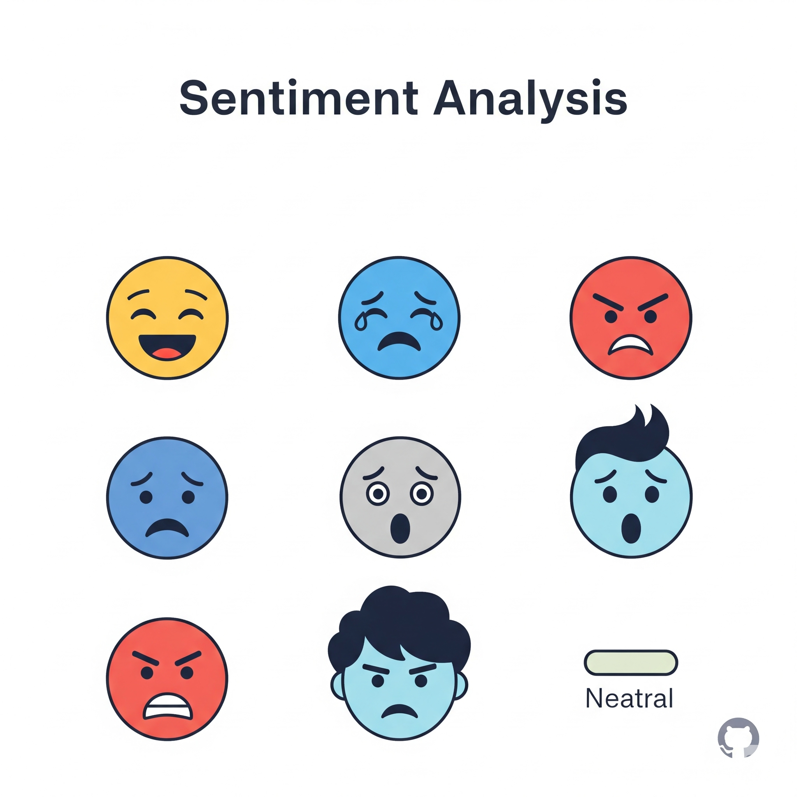

#### Sentiment analysis

This project is a web-based sentiment analysis tool designed to evaluate the sentiment of text reviews (e.g., positive, neutral, negative) and provide tailored suggestions. Users can input reviews manually or upload a CSV/TXT file, and the tool processes the data to display results in a table, including the review, and a suggestion.

#### How It Works
- **User Interface**: The webpage, built with HTML and styled with CSS, features a form for entering reviews or uploading files. Upon submission, the data is sent to a Flask backend for processing.
- **Backend Processing**: The Flask server receives the input, preprocesses the text, applies a trained Random Forest Classifier model to predict sentiment, generates suggestions using a custom function, and returns the results to update the table dynamically.
- **Output**: Results include the original review, a sentiment score (e.g., 2 for positive, 1 for neutral, 0 for negative), and a suggestion, presented in a table.

#### Model Used
The project employs a Random Forest Classifier from scikit-learn, trained on preprocessed text data. The model leverages TF-IDF vectorization to convert text into numerical features, enabling sentiment classification. The specific model is fine-tuned and saved using joblib for deployment in the Flask app.

#### Data Training
- **Dataset**: The model is trained on a dataset of Amazon Product Reviews, readily available on Kaggle.(https://www.kaggle.com/datasets/bittlingmayer/amazonreviews)
  
- **Training Process**: The data undergoes preprocessing with NLTK, including tokenization, stop word removal, and lemmatization (via WordNetLemmatizer). The preprocessed text is converted to TF-IDF features, and the dataset is split for training and validation using train_test_split. The Random Forest Classifier is trained with techniques like resampling (via scikit-learn’s resample) and optimized using accuracy_score and classification_report metrics. The trained model is saved with joblib.

- **Implementation**: Training is performed offline using scikit-learn.

#### Data Analysis
- **Input Handling**: Uploaded or entered text is cleaned and preprocessed using a custom preprocess_text function, likely involving tokenization, stop word removal, and lemmatization.

- **Sentiment Prediction**: The pre-trained Random Forest Classifier processes the TF-IDF vectorized text, assigning a sentiment score based on learned patterns. Scores are mapped to categories (e.g., 2 = Positive, 1 = Neutral, 0 = Negative).

- **Suggestion Generation**: A custom generate_suggestion function creates suggestions based on the sentiment score, possibly using rule-based logic or simple NLP techniques.
  
- **Output**: The results are formatted into a table and rendered on the webpage via Flask.

